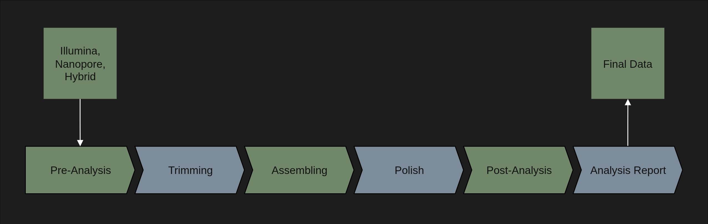

# metareads: automated genome pipeline

**metareads** is a Snakemake-based bioinformatics pipeline for assembling and analyzing metagenomes and complete genomes from microbial communities using diverse sequencing technologies and multiple assembly tools. It supports Illumina, Nanopore, and hybrid datasets. The workflow includes a pre-analysis of raw sequencing data, adapter trimming, assembly, and polishing, followed by post-assembly quality assessment.

## Cite metareads

If you use **metareads** in your research, please cite it as follows:

> Finke, D. (2025). *metareads: A Snakemake-based bioinformatics pipeline for assembling and analyzing metagenomes and complete genomes from microbial communities*. GitHub. Available at: https://github.com/dusti1n/metareads

## Table of Contents
1. [Dependencies](#dependencies)  
2. [Different Plots](#different-plots)   
3. [Use of metareads](#use-of-metareads)
4. [Install Conda](#install-conda)   
4. [Install Environment](#install-environment)  
6. [Configuration Setup](#configuration-setup)  
7. [Run metareads](#run-metareads)  
8. [Analysis Report](#create-analysis-report)  
9. [References](#references)

---

## Dependencies

- [Linux (recommended)](https://ubuntu.com/)  
  The pipeline was developed and tested on the Ubuntu distribution. Linux provides a stable, high-performance environment for running computationally intensive bioinformatics workflows and ensures compatibility with most scientific software.

- [Snakemake](https://snakemake.readthedocs.io/en/stable/)  
  Workflow management system for defining, organizing, and executing reproducible and scalable data analyses. Workflows are described in a readable, Python-based language and executed with automatic handling of dependencies, parallelization, and reproducibility across different computing environments.

- [Conda](https://conda.io/en/latest/index.html)  
  Cross-platform package and environment manager used to install all required software in isolated, reproducible environments. Conda ensures that the correct versions of all dependencies are used and allows easy sharing of the computational environment.

- [Python](https://www.python.org/)  
  Interpreted programming language required as the base for Snakemake and many bioinformatics tools. Python provides the scripting capabilities, modularity, and flexibility needed to integrate multiple steps of the workflow.

- [R (Rscript)](https://www.r-project.org/)  
  Statistical programming language used for downstream analysis, data exploration, and visualization. R supports a wide range of packages for generating publication-ready plots and performing advanced statistical evaluations.

- **Bioinformatics tools**  
  Collection of specialized software integrated into the workflow, including tools for trimming, assembling, polishing, and quality assessment. These tools are automatically installed via Conda and cover all stages from raw data processing to post-assembly evaluation.

## Different Plots
This section showcases example visualizations generated by **metareads**, including workflow DAG plots, data type pathways, and other result summaries. These plots illustrate how the pipeline processes input data through its various stages, from raw read preparation to final analysis outputs.

### Modules Overview
Overview of the main modules and processing stages included in the **metareads** pipeline, from raw read preparation to post-assembly analysis.


<p><b>Fig. 1:</b> Modules of the metareads pipeline.</p>

---

## Use of metareads

This section provides a step-by-step guide to installing, configuring, and running **metareads**. Follow the instructions to set up the environment, prepare the configuration, and execute the workflow on your dataset.

### 1. Install Conda

#### Install **Miniconda3** on Linux with:

```bash
# Download the Miniconda3 installer script
wget https://repo.anaconda.com/miniconda/Miniconda3-latest-Linux-x86_64.sh

# Make the installer script executable
chmod +x Miniconda3-latest-Linux-x86_64.sh

# Start the installation
bash Miniconda3-latest-Linux-x86_64.sh
```

### 2. Install Environment

**1. Create a working directory for your project**

```bash
# Choose any folder name (e.g., metareads_project)
mkdir -p path/to/project-workdir

# Move into the newly created working directory
cd path/to/project-workdir
```

**2. Download the Snakemake workflow from GitHub**

Download the workflow from GitHub as a clone or ZIP file, or skip if already available.

```bash
# Clone the repository into your project directory
git clone https://github.com/dusti1n/metareads.git
```

**3. Create the conda environment**

Navigate to the folder containing `metareads.yaml`, `config_presets/`, and `workflow/`, then create the environment and install all required packages using Conda:

```bash
# Create main 'metareads' environment from YAML file
conda env create -f metareads.yaml

# Activate metareads environment
conda activate metareads
```

### 3. Configuration Setup

Before running **metareads**, set up your configuration file.  
Example configs are provided in `config_presets/` as starting points.

1. **Select data type**  
   Choose whether you will analyze **Illumina**, **Nanopore**, or **Hybrid** datasets.  
   Select the matching config file from `config_presets/`.

2. **Edit the configuration file**  
   Adjust it to match your dataset and resources.  
   Key parameters:  
   - `filename` → Path to input reads  
   - `output_dir` → Output directory name/path  
   - `data_type` → illumina / nanopore / hybrid  
   - `threads` → CPU cores to use  
   - `memory` → RAM in MB (e.g., 30000 for 30 GB)  
   - `assembler` → 1–2 assemblers supported for your data type

3. **Assemblers by data type**  
   - **Illumina:** Spades, MEGAHIT  
   - **Nanopore:** Flye, Canu  
   - **Hybrid:** Hybrid_Spades, Flye  

Set `status: true` to enable or `status: false` to disable assemblers.  
Adjust assembler parameters if needed.


### 4. Run metareads

Once your **conda environment** is activated and your **configuration file** is set up, you can start the analysis.

1. **Create the sample dataframe**  
   This step generates a dataframe for all samples, specific to the chosen data type.  
   Run:
   ```bash
   python3 create_dataframe.py config_presets/<your_config>.yaml
   ```

2. **Preview and start the analysis**  
   Use `-n` to preview the workflow without running it. Remove `-n` to start the actual analysis:
   ```bash
   # Preview workflow
   snakemake --use-conda --cores all --configfile config_presets/<your_config>.yaml -n

   # Run analysis
   snakemake --use-conda --cores all --configfile config_presets/<your_config>.yaml
   ```

---

## Analysis Report

**After the analysis has successfully completed**, you can review your assembled genomes and quality metrics. The assembled genomes are stored in your project’s output directory (as defined in the `output_dir` parameter of your config) and can be further inspected with tools like **QUAST** or **BUSCO**.

To generate a summary report in HTML format (without re-running the analysis), run:  
```bash
# Generate an HTML report summarizing the analysis results
snakemake --use-conda --cores all \
  --configfile config_presets/<your_config>.yaml \
  --report results_metareads/<your_output_dir>/<your_project_name>_report.html
```

**Example:**  
```bash
# Example: Generate report for a hybrid dataset using hSpades and Flye
snakemake --use-conda --cores all \
  --configfile config_presets/hybrid_hSpades_flye.yaml \
  --report results_metareads/project_hybrid/project_hybrid_report.html
```

**Viewing plots in the HTML report:**  
- All plots generated during the analysis are also stored in the results directory.  
- In the HTML report, open the file in your browser and use the left-hand navigation to select a section, such as **QUAST** or **BUSCO**.  
- Click **View** to display the respective plot or table.  
- Plots can be viewed individually or side-by-side for easier comparison.  
- The raw result files for QUAST, BUSCO, and other analyses can be downloaded directly from the report interface.

**Note:** The HTML file can be opened in any modern web browser to quickly explore and download results.

---

## References

**Workflow & Environment**  
* Köster, Johannes, and Sven Rahmann. (2012). “Snakemake—a scalable bioinformatics workflow engine.” *Bioinformatics*, 28(19), pp. 2520–2522.  
* Anaconda, Inc. (2012). “Conda - package, dependency and environment management for any language.” Available at: https://docs.conda.io/  
* Van Rossum, Guido, and Fred L. Drake. (2009). *Python 3 Reference Manual*. Scotts Valley, CA: CreateSpace.  
* R Core Team. (2023). *R: A Language and Environment for Statistical Computing*. R Foundation for Statistical Computing, Vienna, Austria. Available at: https://www.R-project.org/  

**Preprocessing & Quality Control**  
* Andrews, S. (2010). *FastQC: A Quality Control Tool for High Throughput Sequence Data*. Available at: https://www.bioinformatics.babraham.ac.uk/projects/fastqc/  
* Martin, Marcel. (2011). “Cutadapt removes adapter sequences from high-throughput sequencing reads.” *EMBnet.journal*, 17(1), pp. 10–12.  
* Wick, Ryan R., et al. (2017). *Porechop: adapter trimmer for Oxford Nanopore reads*. Available at: https://github.com/rrwick/Porechop  
* De Coster, Wouter, et al. (2018). "NanoPack: visualizing and processing long-read sequencing data." *Bioinformatics*, 34(15), pp. 2666–2669.  
* Ewels, Philip, et al. (2016). “MultiQC: Summarize analysis results for multiple tools and samples in a single report.” *Bioinformatics*, 32(19), pp. 3047–3048.  

**Assembly**  
* Bankevich, Anton, et al. (2012). “SPAdes: A new genome assembly algorithm and its applications to single-cell sequencing.” *Journal of Computational Biology*, 19(5), pp. 455–477.  
* Li, Dinghua, et al. (2015). “MEGAHIT: An ultra-fast single-node solution for large and complex metagenomics assembly via succinct de Bruijn graph.” *Bioinformatics*, 31(10), pp. 1674–1676.  
* Kolmogorov, Mikhail, et al. (2019). “Assembly of long, error-prone reads using repeat graphs.” *Nature Biotechnology*, 37(5), pp. 540–546. (Flye)  
* Koren, Sergey, et al. (2017). “Canu: scalable and accurate long-read assembly via adaptive k-mer weighting and repeat separation.” *Genome Research*, 27(5), pp. 722–736.  

**Polishing**  
* Walker, Bruce J., et al. (2014). “Pilon: an integrated tool for comprehensive microbial variant detection and genome assembly improvement.” *PLOS ONE*, 9(11): e112963.  
* Vaser, Robert, et al. (2017). “Fast and accurate de novo genome assembly from long uncorrected reads.” *Genome Research*, 27(5), pp. 737–746. (Racon)  

**Post-Assembly Quality Assessment**  
* Gurevich, Alexey, et al. (2013). “QUAST: quality assessment tool for genome assemblies.” *Bioinformatics*, 29(8), pp. 1072–1075.  
* Manni, Mosè, et al. (2021). “BUSCO Update: Novel and Streamlined Workflows along with Broader and Deeper Phylogenetic Coverage for Scoring of Eukaryotic, Prokaryotic, and Viral Genomes.” *Molecular Biology and Evolution*, 38(10), pp. 4647–4654.  
